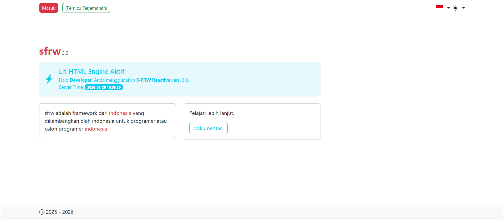
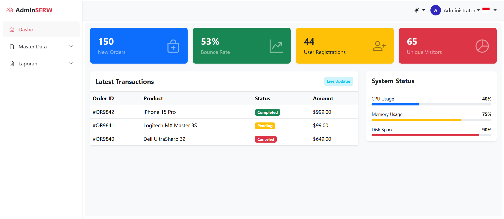

# S-FRW Framework (v3.0) 🚀

**Sunda Framework (S-FRW)** adalah framework PHP modern yang dirancang untuk kecepatan, kesederhanaan, dan pengalaman pengembangan yang luar biasa (**Vibe Coding**). Framework ini menggabungkan kekuatan PHP di sisi server dengan reaktivitas modern di sisi klien.

## ✨ Fitur Unggulan

-   **🚀 SPA (Single Page Application)**: Navigasi antar halaman instan tanpa refresh penuh menggunakan sistem *AJAX-driven navigation*.
-   **⚛️ Reactive UI dengan lit-html**: Integrasi native dengan `lit-html` untuk membangun komponen UI yang reaktif dan ringan.
-   **🔥 Native Live Reload**: Pembaruan tampilan secara instan saat Anda mengubah kode, menggunakan teknologi *Server-Sent Events (SSE)*.
-   **🛡️ PHP 8.1 Ready**: Sepenuhnya dioptimalkan untuk PHP 8.1+ dengan driver database `mysqli` yang stabil dan aman.
-   **🛠️ Advanced Error Handler**: Tampilan error yang cantik dengan cuplikan kode dan sorotan baris untuk mempercepat debugging.
-   **🌗 Dark Mode Native**: Dukungan mode gelap dan terang yang tersinkronisasi di seluruh aplikasi.
-   **💾 Singleton Database**: Koneksi database yang efisien dan terpusat melalui Container.
-   **💎 Pembangun Kueri (Query Builder)**: Antarmuka database yang fasih, aman dari SQL Injection, dan mendukung driver MySql/MySqli secara transparan.

## 📁 Struktur Folder Utama

-   `app/`: Logika inti aplikasi dan model berbasis skema.
-   `mvc/controller/`: Pengendali alur aplikasi.
-   `mvc/view/`: Tempat semua tampilan dengan ekstensi `.view.php`.
-   `library/`: Mesin utama framework (Core, PembangunKueri, Container).
-   `web/route.php`: Pusat pengaturan URL/Rute aplikasi.
-   `public/`: Folder publik untuk aset dan server live reload.

## 🛠️ Panduan Pengembangan (Vibe Coding)

S-FRW mendukung gaya pengembangan **"Vibe Coding"**, di mana Anda fokus pada membangun fitur dengan cepat dan intuitif.

1.  **Lihat Filosofi Desain**: Pelajari prinsip dasar di [DESIGN.MD].
2.  **Mulai Membangun**: Ikuti contoh praktis membangun fitur di [APP.MD].

## 🔧 Konfigurasi Cepat

1.  **Instalasi**: Download atau clone repositori ini ke lokal Anda.
2.  **Konfigurasi**: Ubah file `env.php` untuk mengatur lingkungan dan URL aplikasi.
3.  **Database**: Konfigurasi database di file `web/route.php`.
4.  **Server**: Jalankan server PHP dan database.
5.  **Aplikasi**: Jalankan server PHP dan browser Anda dan akses aplikasi Anda di `http://localhost/sfrw_3/`.
6.  **Seeding**: Jalankan perintah pada url `[nama_folder_project]/setup-database/seeding-sfrw` untuk mengisi database dengan data awal.
7.  **Login**: Login dengan akun admin (username: admin, password: admin123).
8.  **Auto Language**: S-FRW akan mengatur bahasa untuk otomatis dengan contoh. `<span id="id-lupa-password" class="title-class" data-lang-id="id-lupa-password">Lupa password?</span>` pada label yang memiliki atribut `data-lang-id` yang sama dengan ID element dan akan di distribusikan melalui file (public/kamus.txt), pastikan id dibuat unik.


### Environment (`env.php`)
```php
define('ENVIRONMENT', 'local'); // Gunakan 'local' untuk mengaktifkan Live Reload
define('DEBUG', 'true');        // Tampilkan detail error saat pengembangan
define('BASEURL', 'http://localhost/sfrw_3/');
```

### Fitur Pembangun Kueri

Pembangun Kueri S-FRW memungkinkan Anda berinteraksi dengan database dengan sintaks yang bersih dan aman:

```php
// Mengambil satu data berdasarkan kriteria
$user = PembangunKueri::tabel('users')
        ->pilih('fullname', 'email')
        ->dimana('username', '=', 'admin')
        ->pertama();

// Mengambil banyak data dengan pengurutan
$posts = PembangunKueri::tabel('posts')
        ->urutkan('created_at', 'DESC')
        ->batas(10)
        ->dapatkan();

// Menyisipkan data baru (Auto-Escape)
$newId = PembangunKueri::tabel('logs')->sisipkan([
    'activity' => 'User Login',
    'time' => DATEWMIN
]);

// Memperbarui data
PembangunKueri::tabel('users')
    ->dimana('id', '=', 1)
    ->perbarui(['active' => 'Y']);
```

## �🛡️ Keamanan & Performa

-   **SQL Injection Protection**: PembangunKueri secara otomatis melakukan *escaping* pada semua data input.
-   **XSS Protection**: Helper `anti_injection()` tersedia untuk membersihkan input pengguna.
-   **Session Fixation Protection**: Regenerasi ID session otomatis saat login sukses.
-   **SSE Stream**: Live reload menggunakan koneksi persisten yang sangat hemat resource dibandingkan polling tradisional.
-   **Performance**: Optimasi untuk kecepatan dan efisiien, menghindari memori lek dan resource lek.
-   **Maintenance**: Mudah untuk diperbarui dan diperbaiki, dengan struktur folder yang terstruktur dan konsisten.
-   **Support**: Dukungan komunitas yang aktif dan sederhana, dengan forum dan GitHub untuk bantuan dan kontribusi.
-   **Module**: Module bawaan dan tidak perlu install.

## 🤝 Kontribusi

S-FRW dibangun dengan ❤️ untuk komunitas developer yang menginginkan framework ringan namun bertenaga. Silakan kirimkan saran atau laporkan bug untuk membantu kami berkembang.

# ScreenShot





---
**Sunda Framework (S-FRW)** - *Fast, Simple, and Reactive.*
